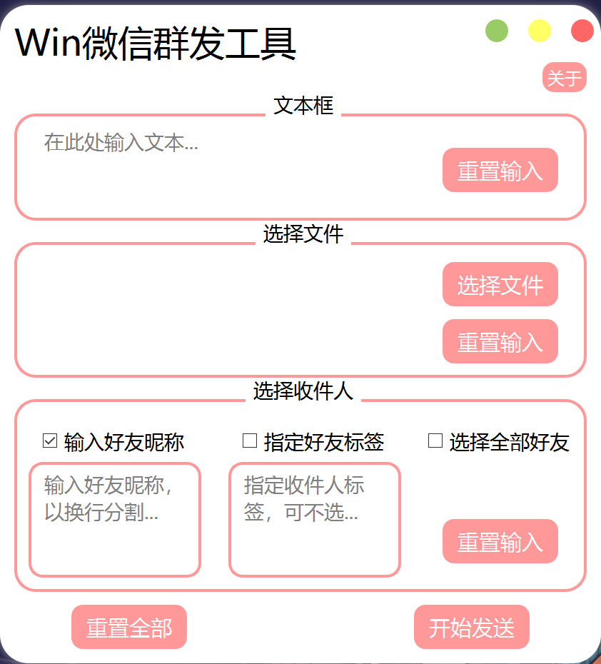

# Wechat_mass_msg

微信群发消息，Windows系统客户端（PC端

## 主要技术
- gui使用了pyside2
- 操作WeChat的模块是 uiautomation


## 界面展示
**主页面**



---

**关于页面**


## 依赖

```python
pip install -r requirements.txt
```


## 注意事项

> 不要做坏事，不要做坏事，不要做坏事！！！（不过看起来也做不了坏事

- 需要先登录好Windows系统客户端的微信

- 使用了PC端默认的快捷键 **Ctrl + Alt + W** 打开微信，如果更改了默认快捷键，则将**45行**的快捷键修改为你电脑的快捷键。


## 使用示例
> 直接运行 main.py


**操作WeChat的代码**

wechat_operation/wx_operation.py
> 在发送消息 **send_msg** 函数中，无论是发送单条还是多条，都需要传入可迭代对象（eg：list(), tuple()...
>
> 可以同时发送**文本** 和 **文件**，但不可同时都不发送！至少发送其中一种。


```python
# 实例化WxOperation类
wx = WxOperation()

# 发送文本
wx.send_msg('好友名称', msgs=['hello', 'world'])

# 发送文件
wx.send_msg('好友名称', file_paths=['README.md', 'wx_operation.py'])

# 发送文本和文件
wx.send_msg('好友名称',  msgs=['hello', 'world'], file_paths=['README.md', 'wx_operation.py'])

# 批量发送
wx.send_msg(*['好友1','好友2'...], msgs=['hello', 'world'], file_paths=['README.md', 'wx_operation.py'])

# 获取微信好友
wx.get_friend_list()	# 获取全部好友
wx.get_friend_list(tag='你的标签')  # 获取指定标签好友
```


其他的自己去翻一翻代码吧，除去注释都不到100行代码。


## 免责声明

帮助我们处理群发消息的繁琐，解放双手（**免责声明**，本代码仅用于学习，下载后请勿用于商业用途）

