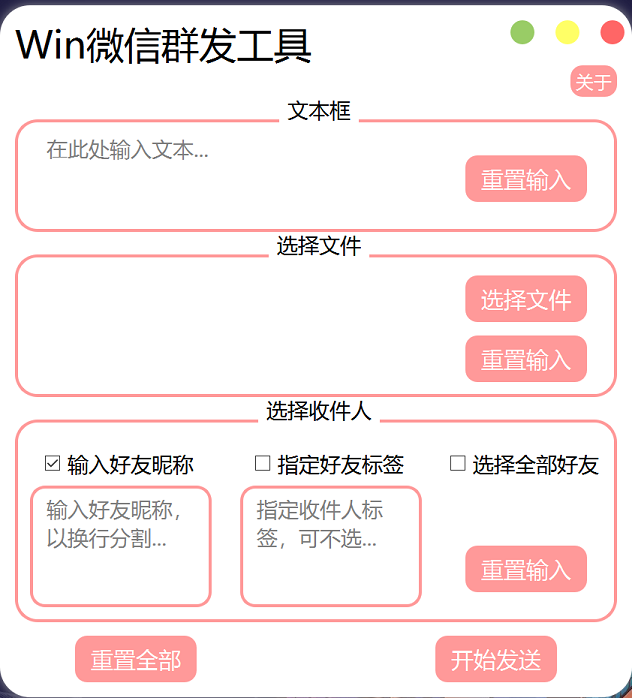
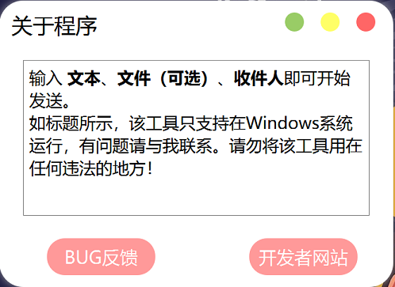

# WeChat-mass-msg

微信群发消息，Windows系统客户端（PC端

## 主要技术
- `gui` 使用了 `pyside6`
- 操作 `WeChat` 的模块是 `uiautomation`

## 界面展示


**主页面**



---

**关于页面**





## 更新内容
<details>
<summary>2023/12/15 更新</summary>

1. 唤醒`WeChat` 由快捷键更改为`Windows`系统层面唤醒微信窗口
    ```python
    def __wake_up_window():
        """唤醒微信窗口"""
        hwnd = win32gui.FindWindow('WeChatMainWndForPC', '微信')
        # 展示窗口
        win32gui.SetForegroundWindow(hwnd)
        win32gui.ShowWindow(hwnd, win32con.SW_SHOWDEFAULT)
    ```

2. 完善在没有100%匹配好友昵称时候，获取当前面板的昵称做匹配
    ```python
    # 获取到真实的昵称（获取当前面板的备注名称）, 有时候输入不全, 可以搜索到，但输入内容时候会报错
    for idx in range(1, 10):
        name = self.wx_window.TextControl(foundIndex=idx).Name
    ```
3. 工具启动时，`WeChat`和工具都会置顶，工具关闭是`WeChat`最小化。

</details>

## 安装依赖

```bash
pip install -r requirements.txt
```


## 关于打包
- 当然，不打包直接执行 main.py，也是一样使用的。
```bash
pyinstaller -F -w --icon=resources/icon/icon.ico main.py
```


## 注意事项

> 不要做坏事，不要做坏事，不要做坏事！！！（不过看起来也做不了坏事

- 需要先登录好Windows系统客户端的微信
- ~~唤醒WeChat默认快捷键为**Ctrl + Alt + W**，这里我使用了自定义的快捷键**Ctrl + Alt + Z**， 
  可在 **wechat_operation/wx_operation.py** 的 **49行** 处修改为你对应的快捷键。~~


## TODO List

- [x] 采用 多线程 `ThreadPool` + `QRunnable`，工具不会卡顿
- [x] 拆解重构成MVC架构
- [x] 添加暂停按钮
- [x] 添加进度条
- [ ] 最小化到右下方任务栏&快捷键唤醒
- [ ] 自定义配置，如导入名单，txt、csv、excel等格式
- [ ] 自定义配置，如发送失败的名单记录导出
- [ ] ...


## 使用示例
> 直接运行 main.py


**操作WeChat的代码**

- wechat_operation/wx_operation.py
> 在发送消息 **send_msg** 函数中，无论是发送单条还是多条，都需要传入可迭代对象（eg：list(), tuple()...
>
> 可以同时发送**文本** 和 **文件**，但不可同时都不发送！至少发送其中一种。


```python
# 实例化WxOperation类
wx = WxOperation()

# 发送文本
wx.send_msg('好友名称', msgs=['hello', 'world'])

# 发送文件
wx.send_msg('好友名称', file_paths=['README.md', 'wx_operation.py'])

# 发送文本和文件
wx.send_msg('好友名称',  msgs=['hello', 'world'], file_paths=['README.md', 'wx_operation.py'])

# 批量发送
wx.send_msg(*['好友1','好友2'...], msgs=['hello', 'world'], file_paths=['README.md', 'wx_operation.py'])

# 获取微信好友
wx.get_friend_list()	# 获取全部好友
wx.get_friend_list(tag='你的标签')  # 获取指定标签好友
```


其他的自己去翻一翻代码吧，除去注释都不到100行代码。


## 免责声明

帮助我们处理群发消息的繁琐，解放双手（**免责声明**，本代码仅用于学习，下载后请勿用于商业用途）

